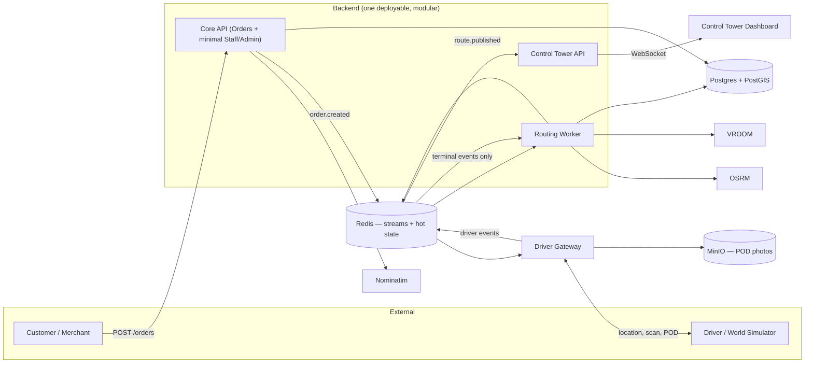

<!-- Technical Architecture Document defining service boundaries, data flows, and tech stack. -->
<!-- Architectural specification documenting the Redis Stream & Hash state model. -->
# Architecture — Last-Mile Delivery Orchestration Platform

Not a full system design — the working architecture for the 3-month prototype. Companion to `PRD.md`.

## 1. High-Level Diagram

## 2. Component List

| Component | Owns | Deployment |
| --- | --- | --- |
| **Core API** (was "Orders API") | Order creation, geocoding call, nearest-facility assignment, `order.created` to `orders_stream`; minimal Staff/Admin scope (view all data, unstick a broken order — nothing more) | Backend deployable |
| **Routing Worker** | Consumes `orders_stream`, batches per facility, calls OSRM/VROOM, publishes `route.published`. **Also** runs a second consumer group on `driver_events_stream` filtered to terminal events (`delivery.completed`/`delivery.failed`) — owns the `delivery_attempt` Postgres write and the `processed_event` idempotency check for those events | Backend deployable |
| **Control Tower API** | Consumes `driver_events_stream` (all events, including live pings), holds hot state in a Redis Hash, pushes to dashboard over WebSocket, rescue trigger. **No Postgres access** — this is deliberate, see ADR #6 | Backend deployable |
| **Driver Gateway** | Auth for driver clients, ingests location/scan/POD events, forwards to Redis Streams. No Postgres access | Separate deployable — internet-facing, untrusted-client trust boundary |
| **World Simulator** | Synthetic drivers + order generation, calling only public APIs | Separate process, external client role |
| `db-models` (shared package) | SQLAlchemy models for every Postgres table — the single source of truth for schema shape, imported by Core API and Routing Worker only | Shared library, not a running process |
| Postgres + PostGIS | System of record, spatial queries | Managed infra |
| Redis | Event backbone (Streams — replay, consumer groups via `XREADGROUP`) **and** Control Tower's hot in-memory driver/order state, one instance serving both | Managed infra |
| OSRM / VROOM | Travel-cost matrix, CVRPTW solve (assignment, capacity, time windows) | Self-hosted containers |
| Nominatim | Address → lat/lng | Self-hosted container |
| MinIO | POD photo storage | Self-hosted container |

## 3. Data Flow

1. Customer/Merchant submits an order → **Orders API** geocodes the dropoff address via Nominatim, runs a PostGIS KNN query to assign the nearest facility, writes the order, appends to `orders_stream` (`XADD orders_stream MAXLEN ~ 50000 * ...`).
2. **Routing Worker** consumes via a Redis Streams consumer group (`XREADGROUP GROUP routing-workers ... STREAMS orders_stream >`), batches pending orders per facility, calls OSRM for travel costs and VROOM for the CVRPTW solve, writes the route to Postgres, and **only after that write commits**, appends to `routes_stream` and `XACK`s the original message. Ack-after-commit, not before — acking first would silently lose the order if the process crashed between the two.
3. **Driver Gateway** delivers the published route to the driver client (real or simulated). The driver client writes every action (location ping, arrival, POD, failure) to a **local durable queue first**, then sends it to Driver Gateway; each event carries a client-generated UUID for idempotent replay, appended to `driver_events_stream`.
4. **Control Tower API** consumes `driver_events_stream` via its own consumer group, updates the driver's **Redis Hash** (`fleet:driver:active:{driver_id}` → `status`, `lat`, `lng`, `last_ping`, `current_route_id`), and pushes only the changed fields to the dashboard over WebSocket — no full re-render per tick. Using a Redis Hash rather than an in-process map means this state survives a Control Tower restart instead of being rebuilt from scratch.
5. On a failed/delayed stop, Control Tower triggers a **rescue**: Routing Worker re-solves only the affected vehicle's remaining stops, not the full day's routes.
6. **Delivery persistence:** Routing Worker's second consumer group reads `driver_events_stream` for terminal events only (`delivery.completed`/`delivery.failed`). Before acting, it checks the event's client UUID against `processed_event` (idempotency); if new, it writes `delivery_attempt` and updates `order.status`, inserts into `processed_event`, then acks. Live location pings are never checked against `processed_event` — overwriting a Redis Hash with the same values twice is naturally idempotent, so only writes with real side effects need the dedupe table.
7. **Crash recovery:** every 30s, Routing Worker runs `XAUTOCLAIM` against `orders_stream`; any message still in the Pending Entries List after 60s (its original consumer crashed mid-task) is reclaimed and reprocessed. Without this, a crashed worker's in-flight order is stuck forever.

All three streams (`orders_stream`, `routes_stream`, `driver_events_stream`) use `MAXLEN ~` trimming — Redis Streams live entirely in memory, so an untrimmed stream is a slow path to exhausting Redis's RAM, which would take down the event backbone *and* the hot-state store together, since they now share one instance.

## 4. Tech Stack Decisions (locked)

| Layer | Choice | Why |
| --- | --- | --- |
| Language/framework | **Python + FastAPI** | Team's chosen language for all backend services (Orders API, Routing Worker, Control Tower API, Driver Gateway) |
| Transactional store | **PostgreSQL + PostGIS** | Single store covers relational + spatial (nearest-facility, nearest-driver) without a second database to run |
| Event backbone + cache | **Redis (Streams + hot state, one instance)** | Reversed from Kafka: Redis Streams' consumer groups (`XREADGROUP`/`XACK`) give the same replay/at-least-once semantics without a second piece of infra (no KRaft setup, no topic design, no separate ops burden) — and it's the same Redis already needed for Control Tower's sub-millisecond hot-state reads, so this removes a whole service rather than adding one |
| Routing engine | **OSRM + VROOM** | Purpose-built open-source tools for travel cost and CVRPTW solving — capacity, time windows, and cost optimization come from configuring VROOM's input, not hand-written logic |
| Spatial indexing | **PostGIS GiST index** | Answers nearest-facility/nearest-driver queries in O(log n); H3 deferred since it solves a global-scale problem this build doesn't have |
| Geocoding | **Self-hosted Nominatim** | Reversed from a hosted API: the World Simulator generates continuous synthetic order volume, which would burn through any provider's free-tier rate limit and risk real cost. Nominatim is the only option with zero cost regardless of traffic. Trade-off: weaker accuracy than Google on informal addresses — acceptable since the prototype proves the pipeline, not address-matching precision |
| Object storage | **MinIO** | S3-compatible, self-hosted, matches the rest of the stack |
| Driver offline sync | **Local durable queue (IndexedDB) + idempotent replay** | Single-writer problem (one driver's own phone) — no concurrent-edit conflict exists, so CRDT sync was rejected as solving a problem this system doesn't have |
| Real-time push | **WebSockets** | Direct fit for Control Tower's live-state requirement, no polling |
| Frontend | **Plain HTML/CSS/JS** | No build tooling or framework-onboarding overhead for the squad; not fully final, pending confirmation |
| Local dev | **Docker Compose** | Single command brings up Postgres, Redis, OSRM, VROOM, Nominatim, MinIO together |

## 5. Key Architectural Decisions (ADR-lite)

1. **Modular monolith — one shared codebase, but Orders API, Routing Worker, and Control Tower API each run as their own process, not one bundled process. Driver Gateway is a separate service regardless.** Chose one repo/codebase over three separate microservice repos, because one person (platform/backend owner) is responsible for all three and splitting them into fully independent services would add operational overhead (separate CI, separate on-call, independent API versioning) with no team-topology benefit. But the three components already only communicate through Redis Streams events and Postgres — never direct function calls — so there is no coupling reason to run them in a single OS process either. Running each as its own process (same codebase, three entrypoints/containers) costs nothing extra and buys real fault isolation: a crash or hang in Routing Worker (e.g. a blocked VROOM call) no longer takes down Orders API or the live dashboard. Driver Gateway is split out for a separate reason — it's the only component with a genuinely different trust boundary, accepting traffic from untrusted external clients.
2. **The World Simulator is an external API client, not an internal test fixture.** Chose this over mocking/seeding data directly into Postgres, because the whole point of the simulator is to prove the real ingestion, event, and tracking pipeline works — a fixture that bypasses the API path would validate nothing about the actual system.
3. **Redis Streams over Kafka for the event backbone.** Reversed an earlier call to use Kafka. Kafka's replay/consumer-group guarantees are real, but so is its operational cost — KRaft setup, topic design, a whole second piece of infra to run and monitor — none of which this scale actually needs. Redis Streams gives equivalent-enough semantics (`XADD` for publish, `XREADGROUP`/`XACK` for consumer groups and at-least-once delivery) using the same Redis instance already required for Control Tower's hot state, so this is a net reduction in infrastructure, not just a swap. Honest trade-off: Redis Streams' durability and horizontal scaling ceiling are lower than Kafka's — acceptable for a 3-month prototype, worth revisiting only if this ever needs to scale well beyond one Redis instance.
4. **No CRDT for driver offline sync.** Chose a durable local queue + idempotent replay over CRDT-based merge, because the actual problem — a single driver's own device going offline and reconnecting — has exactly one writer per driver's data. CRDTs solve concurrent multi-writer conflicts, which don't exist here; adopting one would be solving a problem the system doesn't have at real implementation cost.
5. **Facility assignment via PostGIS KNN query at order-creation time, not a hardcoded single facility.** Chose this because warehouse-to-door is the literal definition of the product — which facility fulfills an order is a first-class decision, not an implementation detail to defer.
6. **Routing Worker, not Control Tower, owns the `delivery_attempt`/`processed_event` Postgres write for terminal driver events.** Splitting Driver Gateway and Control Tower off from Postgres (ADR-implied trust/latency boundaries) left a real gap: something has to persist "did this delivery succeed or fail" permanently, and Control Tower's Redis-Hash-only design can't. Rather than reopening Control Tower's Postgres-free boundary, Routing Worker takes a second consumer group on `driver_events_stream`, filtered to terminal events only. This keeps "who touches Postgres" to exactly two services (Core API, Routing Worker) instead of three, and keeps Control Tower's job singular: render live state fast, never block on a DB write.
7. **Real-time push stays WebSockets, not Server-Sent Events.** SSE was raised as an option since Control Tower's live feed is one-directional (server→dashboard) and the rescue trigger already goes over a separate REST call, not back over the push channel — which is exactly the shape SSE is built for, and its native browser reconnect would have removed some hand-written reconnect logic. Kept WebSockets instead: it's already implemented in the design, introducing SSE now would be a mid-build protocol swap for a marginal simplification, not a correctness or scope issue. Worth knowing as the honest reason, not "WebSockets were always obviously right."

## 6. Failure Isolation — Concrete Rules

Process separation (ADR #1) protects against one *component* crashing taking down another. It does not by itself protect against a blocking call inside one component freezing that component's ability to serve any request — including unrelated ones. Both are required:

| Dependency | Client | Rule |
| --- | --- | --- |
| Postgres | `asyncpg` (or SQLAlchemy 2.0 async + asyncpg) | Bounded pool size, `command_timeout` set |
| Redis (cache + Streams) | `redis.asyncio` | `socket_timeout` + `socket_connect_timeout` set — covers both plain key reads and `XADD`/`XREADGROUP` calls |
| OSRM / VROOM / Nominatim | `httpx.AsyncClient` | Explicit `connect`/`read` timeout on every call — these are the most likely to hang |

- Every FastAPI endpoint stays `async def`. Any unavoidable sync-only call is wrapped in `asyncio.to_thread(...)` — a blocking sync call inside an async endpoint freezes the entire event loop, taking down every request that process is serving, not just the one that triggered it.
- Connection pools are separate per dependency — Postgres and Redis each get their own pool, so one exhausting its pool can't starve requests that never touch it.
- Health checks are split: `/health/live` confirms only that the process is running (no dependency checks — this is what a container orchestrator should use to decide whether to kill the process); `/health/ready` checks Postgres and Redis and is used for traffic routing, not process liveness.
